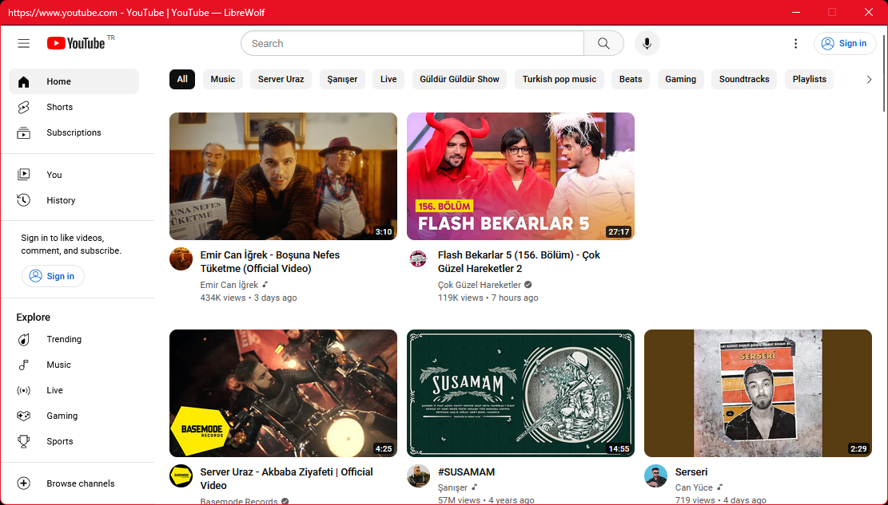

# FireSSB 



> Bring back the SSB mode to FireFox and their forks!

<a href="https://addons.mozilla.org/addon/firessb/" target="_blank"></a>

## Features 

* Default and external Firefox profiles is supported.
* SSBs can have their start menu entry and their windows.
* No native application depency (platform-independent)
* SSBs will have only titlebar for better experience
* All websites can be installed as SSB
* Support for Firefox addon and features

> You can compare with another extensions [from here](./comparison_chart.md)

> 1: You can install the extension within separate profile than your daily one.

## Bugs & Limitations

> Those're firefox limitations. Chromium based browsers haven't most of those limitations.

* SSB windows can not be maximized with button. (Windows, Linux/X11)
* SSB windows is keeping on top of browser window. (Linux/Any)
    > Hint: Use another profile to prevent this issue.
* SSB windows isn't groupped than browser window. (Any)

## Create extension archive

```zip -r FireSSB.xpi * -x .git -x .gitignore -x __assets\* -x \*.xpi -x \*.zip -x \*.crx```

## License

* This project is licensed by Apache 2.0 License.
* This project icon is licensed by Apache 2.0 License.
* [Google Material Symbols](https://developers.google.com/fonts/docs/material_symbols#licensing) is licensed by Apache 2.0 License. (Used in app icon and symbols that located in `./assets/icons/*` )
